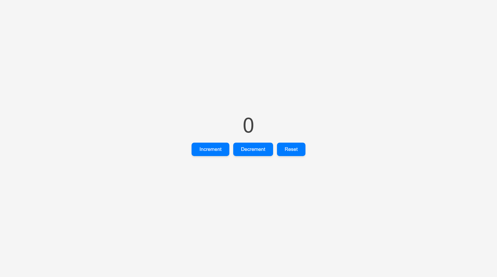

# Counter Program

## Description
### EN 
This project is a simple counter application.   
It allows you to increment, decrement, and reset a counter.

### FR 
Ce projet est une application de compteur.  
Elle permet d'incrémenter, de décrémenter et de réinitialiser un compteur.

## Features | Fonctionnalités
### EN 
- Increment the counter
- Decrement the counter
- Reset the counter to zero
- Display the current counter value
### FR 
- Incrémenter le compteur 
- Décrémenter le compteur 
- Réinitialiser le compteur à 0 
- Afficher la valeur du compteur 

## Screenshot

